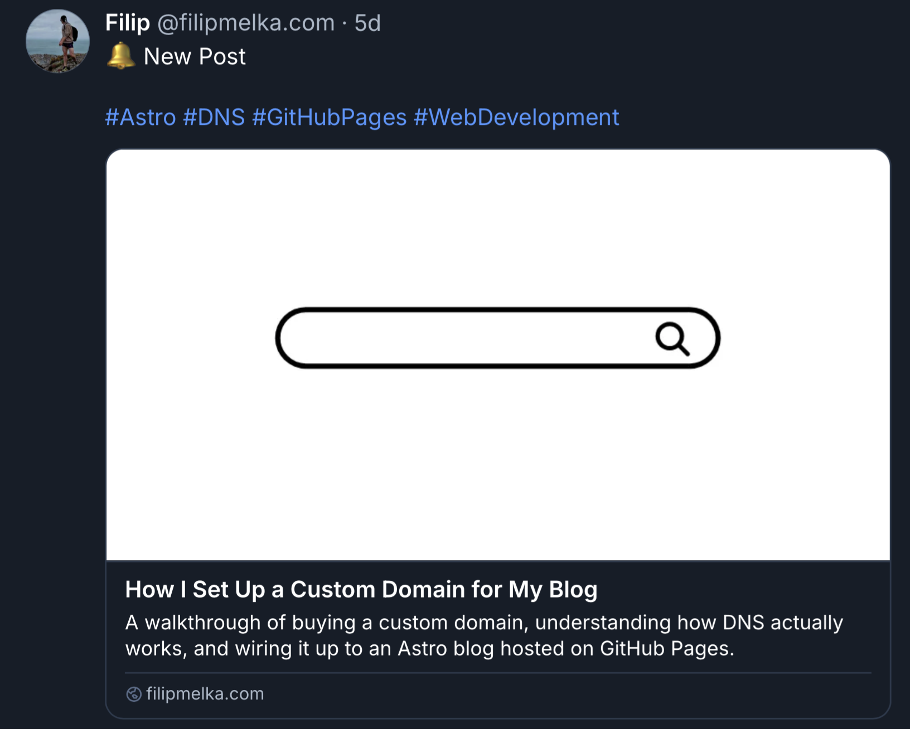

import Interactive from '../components/Interactive.astro'
import { BlueskyAutomationFlow } from './components/bluesky-automation-flow'

A couple of weeks ago, I started my own blog. Recently, I've also started using Bluesky, though so far only for reading - I hadn't posted anything myself. That gap felt like the perfect excuse for a small automation project. In this post, I'll walk through the system I built to auto-announce new articles on Bluesky, with no spreadsheet or database involved.

## A Quick Primer On How This Blog Works

Before getting into the automation, it's worth explaining how the blog itself is put together - the rest of this post assumes it.

This blog runs on [Astro](https://astro.build), and every article is a plain Markdown/MDX file living in `src/articles/`. There's no CMS and no database - I write the article in a text editor, commit it, and Astro takes care of the rest.

Every article starts with a block of **frontmatter** - YAML metadata at the top of the file, wrapped in `---`:

```yaml
---
title: How I Set Up a Custom Domain for My Blog
description: A walkthrough of buying a custom domain, understanding how DNS actually works, and wiring it up to an Astro blog.
pubDate: 2026-08-08
banner: './banners/how-i-set-up-a-custom-domain-for-my-blog.png'
categories: ['Astro', 'DNS', 'GitHub Pages', 'Web Development']
---
```

Astro validates that frontmatter against a schema I define once, in `src/content.config.ts`, using [content collections](https://docs.astro.build/en/guides/content-collections/):

```ts
const articles = defineCollection({
  loader: glob({ pattern: '**/*.{md,mdx}', base: './src/articles' }),
  schema: ({ image }) =>
    z.object({
      title: z.string(),
      description: z.string(),
      pubDate: z.coerce.date(),
      banner: image(),
      categories: z.array(z.string()),
      blueskyText: z.string().optional(),
      blueskyHashtags: z.boolean().optional(),
    }),
})
```

That schema does double duty: Astro uses it to type-check every article at build time (mistype a field name, or forget one that's required, and the build fails immediately, not in production), and every script that touches articles - including the one this whole post is about - reads the exact same fields instead of each parsing frontmatter its own way.

| Field             | Purpose                                                                                                    |
| ----------------- | ---------------------------------------------------------------------------------------------------------- |
| `title`           | Article title - shows up in the page `<head>`, the article list, and (relevant here) the Bluesky link card |
| `description`     | One or two sentence summary - same deal, used in page meta tags and the link card                          |
| `pubDate`         | Publish date - used for sorting the article list, and for the 30-day cutoff mentioned below                |
| `banner`          | The article's cover image, resolved and optimized by Astro's `image()` helper - also the card's thumbnail  |
| `categories`      | Free-form tags shown on the article - also the source for auto-generated hashtags, more on that below      |
| `blueskyText`     | Optional, Bluesky-only - covered later in this post                                                        |
| `blueskyHashtags` | Optional, Bluesky-only - covered later in this post                                                        |

With that in mind, "a new article" - the thing the automation is watching for - is nothing more exotic than a new `.mdx` file landing in `src/articles/` with this frontmatter block at the top. Now, onto the automation itself.

## Overall Goal

The goal was simple: whenever I publish a new article, announce it on Bluesky as a link card - thumbnail, title, and description, the same kind of preview you get when pasting a URL manually.


I ended up building a GitHub Action that runs after every deploy, figures out which articles are new, and posts them on my behalf. Here's how it works.

## Trigger

The whole thing lives in two files:

- `.github/workflows/bluesky-post.yml` (the trigger)
- `scripts/post-new-articles-to-bluesky.mjs` (the logic)

Here is the entire GitHub Action workflow:

```yml
name: Post New Articles to Bluesky

on:
  workflow_run:
    workflows: ['Deploy to GitHub Pages']
    types: [completed]
  workflow_dispatch:

jobs:
  post-to-bluesky:
    if: ${{ github.event_name == 'workflow_dispatch' || github.event.workflow_run.conclusion == 'success' }}
    runs-on: ubuntu-latest
    steps:
      - name: Checkout your repository using git
        uses: actions/checkout@v7
      - name: Setup Node
        uses: actions/setup-node@v5
        with:
          node-version: 24
          cache: npm
      - name: Install dependencies
        run: npm ci
      - name: Post new articles to Bluesky
        env:
          BLUESKY_IDENTIFIER: ${{ secrets.BLUESKY_IDENTIFIER }}
          BLUESKY_APP_PASSWORD: ${{ secrets.BLUESKY_APP_PASSWORD }}
        run: npm run bluesky:post
```

The workflow listens for one thing - a successful deploy:

```yml
on:
  workflow_run:
    workflows: ['Deploy to GitHub Pages']
    types: [completed]
  workflow_dispatch:
```

`workflow_run` fires whenever the deploy workflow finishes, but "finishes" isn't the same as "succeeds," so the job itself is gated:

```yml
if: ${{ github.event_name == 'workflow_dispatch' || github.event.workflow_run.conclusion == 'success' }}
```

A failed deploy never triggers a post - there's no point announcing an article that isn't actually live yet. The `workflow_dispatch` trigger is there for the times I want to run it on demand, from the Actions tab, without waiting for a fresh deploy.

Once triggered, the job checks out the repo, installs dependencies, and runs one command:

```sh
npm run bluesky:post
```

This looks simple on the surface, but the more interesting part is what the script actually has to figure out.

## No State, No Database (Just Ask Bluesky)

The obvious way to track "which articles have already been posted" is a JSON file or a database row per article. I didn't want to maintain either - plus, I have branch protection enabled on `main`, so committing straight to it would be a nightmare - so the script does something more interesting: _it asks Bluesky what it already posted, on every single run_.

```js
async function fetchAlreadyPostedUrls(agent) {
  const posted = new Set()
  let cursor
  for (let page = 0; page < MAX_FEED_PAGES; page++) {
    const { data } = await agent.getAuthorFeed({
      actor: agent.session.did,
      limit: 100,
      cursor,
    })
    for (const item of data.feed) {
      const embed = item.post.record?.embed
      if (embed?.$type === 'app.bsky.embed.external' && embed.external?.uri) {
        posted.add(embed.external.uri)
      }
    }
    cursor = data.cursor
    if (!cursor) break
  }
  return posted
}
```

It pages through the account's own feed via `@atproto/api`, pulls the `external.uri` out of every link-card embed it finds, and builds a set of URLs already announced. From there, finding "new" articles is a one-liner: read every article in `src/articles/`, and keep the ones whose URL isn't in that set.

> The repo never says "I posted article X." Bluesky's own feed is the source of truth.

That's the whole trick, and it means there's nothing to get out of sync - no state file that drifts from reality, no "oops, forgot to commit the tracking JSON."

## The Catch: It Can Only Look Back So Far

Nothing is free, though. The feed lookup pages up to 20 times at 100 posts a page - 2,000 posts, max. Scroll past that, and a post becomes invisible to the deduplication check. I haven't posted much else on Bluesky, so this isn't a real problem yet, but it's a bug waiting to happen: _an old article falls out of the lookback window, the script forgets it was ever posted, and reposts it_.

That's why there's a second guard sitting right next to it - a 30-day cutoff on how old a candidate article's `pubDate` is allowed to be:

```js
const cutoff = Date.now() - RECENT_DAYS * 24 * 60 * 60 * 1000

const alreadyPosted = await fetchAlreadyPostedUrls(agent)
const unposted = articles.filter((article) => !alreadyPosted.has(article.url))
const candidates = unposted
  .filter((article) => article.pubDate.getTime() > cutoff)
  .sort((a, b) => a.pubDate - b.pubDate)
```

The two limits are designed to fail shut together: by the time a post could plausibly scroll outside the 2,000-post lookback - unless I start posting with the frequency of a campaigning politician - it's already well outside the 30-day window too, so it's excluded before the lookback limit would even matter. The back catalogue stays safely un-reposted no matter how long the blog runs.

## Building the Post

Once the script knows which articles are new, it builds each post as a link card - Bluesky's `app.bsky.embed.external` embed, the same kind you get when you paste a URL and Bluesky auto-generates a preview. The difference is I'm building it explicitly:

```js
async function postArticle(agent, article) {
  const bannerBytes = readFileSync(article.bannerAbsPath)
  const { data: blob } = await agent.uploadBlob(bannerBytes, {
    encoding: 'image/png',
  })

  const rt = new RichText({ text: buildFinalText(article) })
  await rt.detectFacets(agent)

  await agent.post({
    text: rt.text,
    facets: rt.facets,
    embed: {
      $type: 'app.bsky.embed.external',
      external: {
        uri: article.url,
        title: article.title,
        description: article.description,
        thumb: blob.blob,
      },
    },
    createdAt: new Date().toISOString(),
  })
}
```

The article's own banner image gets uploaded as a blob and used as the card's thumbnail, and `title` / `description` come straight from the article's frontmatter.

`RichText.detectFacets` is the part that took me a beat to appreciate: without it, hashtags and links in the caption are just plain text - not clickable, not recognized as tags. `detectFacets` scans the text and attaches the metadata that turns `#Astro` into a real, tappable hashtag.

## Controlling the Caption from Frontmatter

I didn't want every announcement to read the same generic "New post" caption forever, but I also didn't want to _have_ to write custom copy for every article. So the caption is optional, controlled per article through two frontmatter fields defined right alongside the rest of an article's metadata in `src/content.config.ts`:

```ts
blueskyText: z.string().optional(),
blueskyHashtags: z.boolean().optional(),
```

When hashtags are enabled, every entry in the article's `categories` list is turned into a hashtag and appended to the caption.

| Field             | Required | What it does                                                                                                                                                                                             |
| ----------------- | -------- | -------------------------------------------------------------------------------------------------------------------------------------------------------------------------------------------------------- |
| `blueskyText`     | no       | Custom caption for this article. Omit it, and the post falls back to a default caption. Set it to an empty string, and the post goes out with _no_ caption at all - just the hashtags, or just the card. |
| `blueskyHashtags` | no       | Overrides the global hashtag toggle for just this article - force hashtags on or off regardless of the site-wide default.                                                                                |

The repo-wide defaults live in one small config file I created, `bluesky.config.json`:

```json
{
  "defaultPostText": "🔔 New Post",
  "hashtagsEnabled": true
}
```

Here's an example from my blog's own article:

```yml
# i-created-a-claude-skill-for-usage-aware-automation.mdx
...
categories: ['Claude', 'Automation']
blueskyText: '🔔 New Post #claude #claude-code'
blueskyHashtags: false
```

That posts the custom caption, hashtags included - `RichText.detectFacets` turns them into real, tappable hashtags on the same line. And because `blueskyHashtags` is set to `false`, it won't also append hashtags derived from `categories`.


Here's one more example:

```yml
# how-i-set-up-a-custom-domain-for-my-blog
...
categories: ['Astro', 'DNS', 'GitHub Pages', 'Web Development']
```

This frontmatter includes neither `blueskyText` nor `blueskyHashtags`, so the post falls back to whatever's set in `bluesky.config.json`:



## Testing It Without Spamming My Own Feed

The one thing I really didn't want was to debug this script by trial and error against my real Bluesky account. `--dry-run` solves that:

```sh
BLUESKY_IDENTIFIER=... BLUESKY_APP_PASSWORD=... npm run bluesky:post -- --dry-run
```

It runs the exact same deduplication and text-building logic, real credentials and all, but logs what _would_ be posted instead of calling `agent.post()`:

```
[dry-run] Would post "start-building-tuis-with-bubble-tea" as a link card:
  text: #Go #TUI
  title: Start Building TUIs with Bubble Tea
  description: A beginner-friendly walkthrough of Bubble Tea...
  uri: https://filipmelka.com/blog/start-building-tuis-with-bubble-tea/
  thumb: /path/to/banner.png
```

That's how I caught most of the rough edges before this ever ran for real - seeing the exact caption, hashtags, and card fields laid out made it obvious when something was off, without a single test post cluttering my actual feed.

## Putting It All Together

Here is the entire workflow:

1. Deploy succeeds
2. The Bluesky workflow wakes up
3. The script pages through my own Bluesky feed to see what's already been announced
4. Filters that against articles published in the last 30 days
5. Builds a caption from frontmatter (or falls back to the defaults)
6. Uploads the banner and posts a link card for anything left over

<Interactive
  fallback="./fallbacks/bluesky-automation-workflow.png"
  caption="Deploy triggers the workflow, which checks its own feed, filters by date, builds a caption, and posts the link card."
>
  <BlueskyAutomationFlow client:visible />
</Interactive>

The part I like most is that there's nothing to forget. I don't maintain a list of "posted" articles, I don't have to remember to trigger anything manually, and I don't write social copy unless I actually want something different from the default. I publish an article the way I always have, and a few minutes later, it just shows up on Bluesky.
