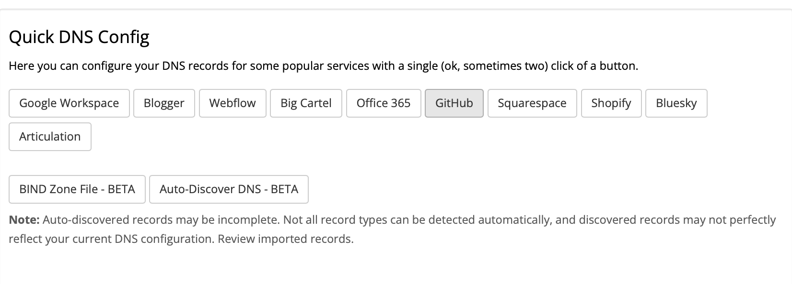
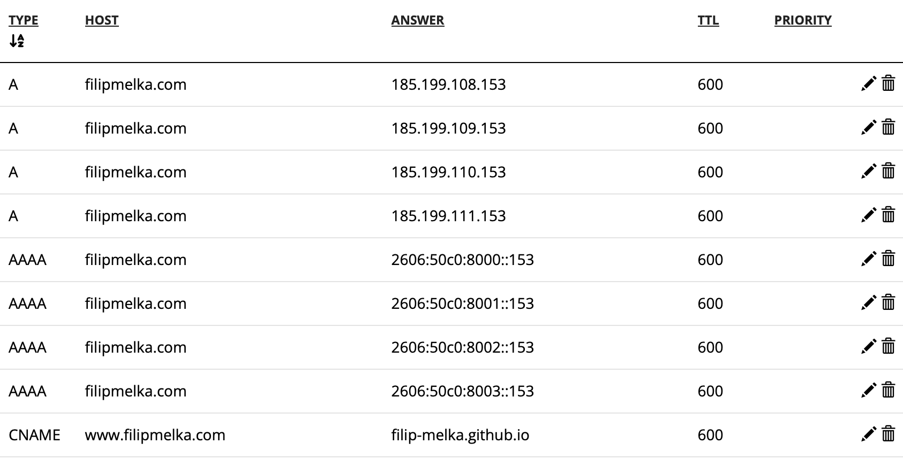
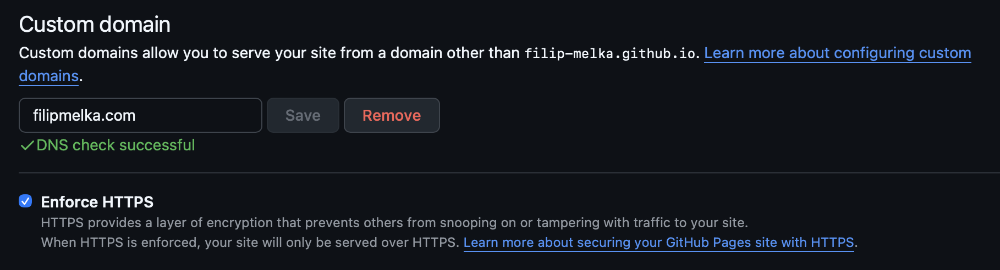

import Interactive from '../components/Interactive.astro'
import { DomainRegistrationFlow } from './components/domain-registration-flow'

I'm building my own blog with [Astro](https://astro.build), hosted as static pages on [GitHub Pages](https://docs.astro.build/en/guides/deploy/github/). At some point "filip-melka.github.io/blog" stops feeling like a real address, so I went and got my own domain. Here's the whole process, start to finish.

## How Does A Domain Work?

Before buying anything, it's worth knowing what you're actually buying. Let's take a domain apart:

```
https://www.example.com
```

- `https`: protocol
- `www`: subdomain
- `example.com`: domain name, made up of:
  - `example`: the name
  - `com`: the Top-Level Domain

### TLD (Top-Level Domain)

The TLD is the suffix at the end of a domain name - `.com`, `.org`, `.net`, `.io`, `.de` etc. TLDs sit at the top of the domain naming hierarchy and fall into a few buckets:

- gTLDs (generic): `.com`, `.org`, `.net`, `.app`, `.dev`
- ccTLDs (country code): `.uk`, `.de`, `.jp`
- sTLDs (sponsored, restricted to specific communities): `.gov`, `.edu`, `.mil`

_Fun fact:_ [ICANN](https://www.icann.org/en) (Internet Corporation for Assigned Names and Numbers) reserves every two-letter TLD exclusively for country codes, which is why gTLDs are always three or more characters. The twist is that some countries have leased out their ccTLD for reasons that have nothing to do with the country, simply because the letters happen to spell something useful:

- `.ai` - Anguilla, now shorthand for every AI startup on earth
- `.me` - Montenegro, popular for personal branding
- `.tv` - Tuvalu, a favorite for streaming/video sites
- `.io` - British Indian Ocean Territory, adopted wholesale by tech and startups

So who actually keeps track of all these TLDs?

### Registries

A **registry** is the organization that owns and operates a particular TLD. Here are some examples of these organizations:

- [Verisign](https://www.verisign.com) runs the registry for `.com` and `.net`
- [Public Interest Registry](https://pir.org) runs `.org`.

The registry holds the authoritative master database for its TLD (who owns what, which name servers each domain points to, when it expires) and runs that TLD's core DNS servers (more on those shortly). Registries generally don't sell to the public directly; you buy through a **registrar** instead.

A **registrar** is the company you actually buy a domain from (GoDaddy, Namecheap, Cloudflare, etc.), accredited by ICANN and by each registry to sell and manage domain names. When you register `example.com`, your registrar submits that registration to the `.com` registry, which adds it to the master database. Once that's done, you become the **registrant** - the person or organization that owns the domain.

<Interactive
  fallback="./fallbacks/buying-domain-diagram.png"
  caption="You buy a domain from a registrar, which registers it with the registry that owns the TLD."
>
  <DomainRegistrationFlow />
</Interactive>

But when someone types your domain into a browser, how does the browser know where to send the request? That's DNS's job.

### DNS (Domain Name System)

DNS is the internet's phone book - it translates human-readable names (`example.com`) into IP addresses (`93.184.216.34`) that computers actually route traffic to. It's organized as a hierarchy:

- Root servers
  - The top of the hierarchy
  - Don't know where `example.com` lives, but know which servers handle `.com`
- TLD servers
  - Know which name servers are authoritative for `example.com` specifically
- Authoritative name servers
  - Usually run by your hosting provider or DNS provider (like Cloudflare)
  - Hold the actual records (A, MX, CNAME, and so on - more on those below)

When you type a URL, your device asks a recursive DNS resolver (often run by your ISP or a public provider like Cloudflare or Google) to look up the name. That resolver walks this chain - root, then TLD, then authoritative - caching the answer along the way so it doesn't repeat the whole walk next time.

One more term worth knowing before we move on: WHOIS privacy.

### WHOIS privacy

WHOIS is a public lookup protocol that shows a domain's registration details:

- Registrant name
- Address
- Email
- Phone number
- Registrar
- Key dates

Historically this was fully public, meaning anyone could look up a domain owner's home address and phone number just by knowing their domain name.

**WHOIS privacy** (also called _domain privacy_ or a _privacy proxy_) lets the registrar swap in its own proxy contact info for the public WHOIS record instead of yours, forwarding any legitimate email through to you. Most registrars now throw this in for free. Worth knowing too: GDPR (via ICANN's Temporary Specification) pushed most registrars to redact personal WHOIS data by default for individual registrants.

### Put together

You pick a name under a **TLD**, buy it through a **registrar**, which registers it with that TLD's **registry**, and the whole thing becomes reachable because **DNS** propagates the routing info - with **WHOIS privacy** optionally shielding your personal details from the public record.

## Buying A Domain

Plenty of services sell custom domains, and most bundle a domain with hosting. Since I'm hosting on GitHub Pages, all I actually needed was the domain itself plus solid DNS control. A few options worth knowing about:

- Porkbun: one of the cheapest full-service registrars, with consistent renewal pricing
- [Cloudflare Registrar](https://www.cloudflare.com/products/registrar/): sells at wholesale cost with no markup - you pay whatever Cloudflare pays the registry, at registration and at renewal
- [Namecheap](https://www.namecheap.com/): a popular all-rounder, though the cheap first-year price is usually followed by a renewal bump

One place I'd personally steer clear of is GoDaddy. I've used it before (bought two domains through them), and beyond the usual steep renewal jump after a cheap first year, they made a change in February 2026 that's worth knowing about: a Terms of Service update reclassified customers as "Business Customers" by default, stripping away consumer protections and pushing disputes into arbitration.

### What domain to buy

Since this is a personal blog, I wanted my own name as the domain. It came down to two options:

- `filipmelka.com`
- `filip-melka.com`

I went with `filipmelka.com`. A few reasons:

- One less keystroke - every extra character is one more chance to typo it
- Hyphens are the first thing people forget when typing a domain from memory
- It's easier to say out loud
- It just looks cleaner

For the TLD, I went with `.com` - it's the one people assume by default, it's the most universal, and it's usually the cheapest and most stable option long-term. There are other reasonable picks:

- `.dev`: popular in software circles
- `.me`: reads nicely for a personal site

One TLD I'd think twice about right now is `.io`. It's had a great run in tech and startup circles, but its future is genuinely uncertain: in May 2025, the UK and Mauritius signed a treaty transferring sovereignty over the Chagos Archipelago (the actual land behind the British Indian Ocean Territory designation that `.io` is based on). If BIOT eventually disappears from the ISO country-code standard, `.io` could face a phased retirement over the following years. As of early 2026 the treaty's ratification has stalled after the US withdrew its consent, so nothing is imminent - but it's not a TLD I'd want to build something long-term on today.

I ended up going with Porkbun and bought `filipmelka.com` for $11.08 for the first year, with the same price at renewal. Domain acquired - now to make it actually do something.

## Set DNS Records

Next up: DNS records. Why? Because my domain name and the actual location of my website are two completely separate pieces of information, and nothing connects them automatically.

When you register a domain, the registry just notes "this name belongs to this registrant, and its authoritative name servers are X." That's it. It has no idea what should happen when someone types that domain into a browser. DNS records are the missing instruction set. They live on your authoritative name servers (Porkbun's, in my case) and answer specific questions:

- "What IP address serves the website?" (needs an A record)
- "What server handles email for this domain?" (needs an `MX` record)
- "Prove you actually control this domain" (needs yet another record)

Here are the main record types you'll run into:

| Record  | Purpose                                                            |
| ------- | ------------------------------------------------------------------ |
| `A`     | Points a domain/subdomain to an **IPv4** address                   |
| `AAAA`  | Same as `A`, but for **IPv6** addresses                            |
| `CNAME` | Alias - points a subdomain to another domain name instead of an IP |
| `MX`    | Points a domain to the mail servers that handle its email          |
| `TXT`   | Arbitrary text (used for domain verification)                      |

Porkbun has a one-click helper for this exact GitHub Pages setup. First, open the DNS config and delete all existing records ("Delete All Records" at the very bottom) - otherwise the old and new records will conflict. In the "Quick DNS Config" section, click "GitHub."



You'll be asked for your GitHub username. Enter it, hit submit, and wait a few seconds. This sets your `A`, `AAAA`, and `CNAME` records automatically. You'll notice several `A` (and `AAAA`) records rather than just one - here's why that's not a mistake.



Multiple `A` records for the same host is a standard DNS technique called **round-robin DNS**. Those aren't four different websites - they're four different edge servers in GitHub's front-end fleet, all serving GitHub Pages content. Publishing all four buys you two things:

- **Redundancy** - if one of GitHub's front-end servers goes down or is under maintenance, your domain still resolves fine via the other three (a single `A` record would be a single point of failure)
- **Load distribution** - when a resolver gets back multiple `A` records for the same name, it typically rotates which one it hands out first, spreading traffic across GitHub's servers instead of hammering just one

## Add The Custom Domain In GitHub

Next, tell GitHub about the domain: repo → Settings → Pages → Custom domain, type it in, hit save. This does two things:

- Stores the custom domain in your Pages configuration
- Kicks off domain verification

DNS propagation can take anywhere from a few minutes to 24 hours. GitHub shows a green checkmark on the Pages settings page once it sees valid records. Once it's green, check "Enforce HTTPS" - GitHub auto-provisions a free [Let's Encrypt](https://letsencrypt.org) certificate for you.



## Update `astro.config.mjs`

The last piece was updating Astro's config: set `site` to my domain, and drop `base` (which you only need when deploying to `username.github.io/repo-name`).

```js
export default defineConfig({
  site: 'https://yourdomain.com',
  base: '/', // or omit
})
```

Once DNS has propagated, HTTPS is enforced, and the site rebuilds, I confirmed everything worked by visiting `https://filipmelka.com` (my canonical URL, set in Pages settings) and `https://www.filipmelka.com` (which GitHub automatically redirects to the canonical one).

I keep saying "canonical URL" - worth explaining what that actually means. It's the address you officially designate as the "real" one: the version you want indexed, linked to, and shown in search results, with everything else redirecting or pointing back to it. When you set Astro's `site` property, Astro generates a `<link rel="canonical" href="...">` tag in your page `<head>`, telling search engines "however someone arrived at this content, treat this URL as the definitive one." This matters for SEO - without it, if the same content is reachable through multiple URLs (with or without `www`, with or without a trailing slash, `http` vs `https`), search engines can split ranking signals across all of them instead of consolidating on one.

The short version:

> When duplicates or variants exist, **canonical** marks which one is the "real" one that everything else defers to.

And with that, I'm happy to say my blog is officially live on its own domain.

Before wrapping up though, a few loose ends worth tying off.

## Next Steps

### Add a sitemap

A sitemap is an XML file listing every URL on your site, so search engines don't have to discover your pages purely by following links around - it's you handing Google a table of contents instead of making it wander your site page by page. It doesn't guarantee indexing or ranking (Google still decides what's worth indexing), but it removes "Google never found this page" as a possible failure mode.

Adding one to an Astro project is really simple - just install [Astro's official sitemap integration](https://docs.astro.build/en/guides/integrations-guide/sitemap/):

```sh
npx astro add sitemap
```

It requires your `site` field to already be set, which I'd already done. On the next `astro build`, it auto-generates `sitemap-index.xml` and `sitemap-0.xml` in `dist/`, listing every page it finds - no manual maintenance as I add articles.

### Add a `robots.txt`

`robots.txt` is a plain text file at your site's root (mine lives at `https://filipmelka.com/robots.txt`) that tells web crawlers which parts of your site they're allowed to crawl. It's the first thing _well-behaved_ bots check before touching anything else on your domain.

To add it, drop a `robots.txt` file in `public/` so it gets copied to your site root:

```txt
User-agent: *
Disallow: /admin/
Disallow: /drafts/
Allow: /

Sitemap: https://filipmelka.com/sitemap-index.xml
```

- `User-agent: *` means "this applies to all bots"
- `Disallow: ...` blocks specific paths
- `Allow: /` explicitly permits everything else
- `Sitemap:` is a common convention pointing crawlers straight to your sitemap

It's a request, not a lock. Well-behaved crawlers (Google, Bing) respect it; malicious scrapers can and do ignore it entirely.

### Add an RSS feed

An RSS feed is an XML file listing your recent posts in a structured, machine-readable format - title, link, publish date, description. It's how people subscribe to a blog without needing an account or an email newsletter.

Instead of a human checking your site, an RSS reader (I use [Feedly](https://feedly.com), though there are plenty of others) periodically polls your feed URL and pulls in anything new, surfacing it alongside every other blog the subscriber follows.

Adding it in Astro is just as easy - just follow the [official guide](https://docs.astro.build/en/recipes/rss/).

### Verify my domain in Google Search Console

[Google Search Console](https://search.google.com/search-console/about) exposes fairly sensitive data - search traffic, which queries bring people to your site, security issues, even the ability to request a URL be pulled from search results. Google isn't going to hand that over to just anyone who types in a domain. Verification (via a DNS TXT record) is how you prove _you_ actually control the domain, rather than someone merely claiming to.

To verify, go to [Search Console](https://search.google.com/search-console/about) → Add Property → Domain (not "URL prefix" - the domain property covers `www`, non-`www`, and both `http`/`https` variants in one shot). Google gives you a TXT record to add, then you click "Verify" - it usually resolves in minutes, occasionally longer.

Once verified, you get visibility into things that were previously invisible:

- **Indexing status:** which pages Google has actually indexed vs. crawled-but-skipped vs. never seen, and _why_ a given page isn't indexed
- **Search performance data:** which queries bring people to your site, your click-through rate, average position
- **Core Web Vitals / mobile usability reports:** page-speed and mobile-friendliness scores that factor into ranking
- **Direct submission tools**: submitting your sitemap, or requesting a re-crawl of a specific page right after you fix something instead of waiting for it to happen naturally

This is my first time using Search Console, so I'm still finding my way around it - I'll write about that experience once I've got more to say. For now, the short version:

> Indexing happens whether you verify or not. Verification is what lets you see what's happening and fix it when something's wrong, instead of only finding out when your traffic mysteriously drops.

## Conclusion

In this article I walked through setting up my own custom domain, start to finish. We started with the theory - what a domain is actually made of, and who's responsible for each piece - then I covered why I picked `filipmelka.com` and Porkbun as my registrar. From there, we set the DNS records and added the custom domain in GitHub, so that when someone types my domain into a browser, they land on the content hosted on GitHub Pages.
