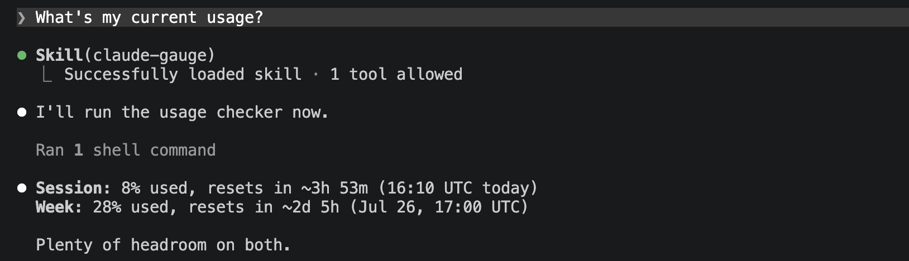
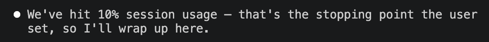

I built and published my first Claude skill: [Claude Gauge](https://github.com/filip-melka/claude-gauge).

_Quick side note:_ it's only been tested on macOS so far — if you try it on something else, I'd love to hear how it goes.

The skill lets Claude see your current usage and reset times for both the session and weekly limits, in Claude Code and Claude Desktop.

That, in turn, makes it possible to automate around your subscription limits. But first, here's why I needed this in the first place.

## The Problem

I'm on Claude's [Pro plan](https://claude.com/pricing), which has two separate usage limits:

- A session limit
- A weekly limit

The session limit resets every five hours, but whatever you don't use doesn't roll over — in other words, if you don't use it, you lose it. Same story with the weekly limit.

My goal was simple: get the most out of my subscription by putting unused tokens to work before they expire. Specifically, I wanted Claude to pick up lower-priority tasks near the end of a session window, instead of letting that capacity go to waste.

Basically, I wanted to be able to tell Claude something like:

> Check my usage every hour. If the session usage is below 40% or resets in less than 30 minutes, start working on the items from the backlog.

Simple enough — except for one catch.

### Why not ask Claude directly?

Claude Code has no built-in access to your usage numbers. Seeing them means typing `/usage` yourself; Claude can't invoke that command on its own.

So to automate around usage, I needed a way to give Claude access to it — which is how [Claude Gauge](https://github.com/filip-melka/claude-gauge) was born.

## How Claude Gauge Works

Claude Gauge gives Claude Code visibility into both your session and weekly usage, plus their reset times. But if Claude can't run `/usage` itself, and headless mode (`claude -p`) doesn't support UI-only slash commands, how does it actually get that data?

The skill spawns a real interactive `claude` process inside a pseudo-terminal (via [`node-pty`](https://github.com/microsoft/node-pty)), types `/usage` into it just like a person would, and waits for the output to settle. From there, it feeds the raw PTY byte stream into a headless terminal emulator ([`@xterm/headless`](https://www.npmjs.com/package/@xterm/headless)) rather than parsing the bytes directly — the TUI (terminal UI) repaints panels in place using cursor-positioning escape codes, so simply concatenating the raw output would produce garbled, overlapping text. Reading the emulator's final rendered screen buffer instead gives one clean frame, exactly what you'd see if you'd typed the command yourself. From there, it's just regex over that screen text to pull the "Current session" and "Current week (all models)" blocks — percent used and reset time — convert the reset time into an absolute timestamp and a countdown in milliseconds, and print the result as JSON.

```json
{
  "currentSession": {
    "used": 0.14,
    "resetsAt": "2026-07-19T16:00:00.000Z",
    "resetsIn": 7089559
  },
  "currentWeek": {
    "used": 0.35,
    "resetsAt": "2026-07-19T17:00:00.000Z",
    "resetsIn": 10689559
  }
}
```

_One downside:_ since this is essentially screen-scraping the official TUI, it's a bit brittle across Claude Code version changes. There's also a `--raw` flag that dumps the unparsed panel, handy for debugging if the parsing ever breaks.

## Usage

To get started, follow the instructions in the [README](https://github.com/filip-melka/claude-gauge).

After cloning the repo, if you want the skill available across all your projects, run the install script:

```sh
./install
```

This does two things:

- Copies the skill into `~/.claude/skills/` (replacing any older version already there)
- Installs the `npm` dependencies

Then open Claude Code and ask:

> What's my current usage?

A few seconds later, you should see something like this:



On its own, having Claude tell you your usage isn't all that useful — you could just type `/usage` and get the same answer, faster. The real value is in automating around it.

### Using with [`/loop`](https://code.claude.com/docs/en/scheduled-tasks#run-a-prompt-repeatedly-with-/loop)

Combine Claude Gauge with the built-in `/loop` skill, and you can build your own automations that put unused tokens to work instead of letting them vanish.

To burn through leftover weekly usage, for example:

> Every Sunday at 8AM check my usage. If my weekly limit is below 80%, start working on the items in the project backlog.

Or lean on the reset times instead:

> Check my usage every hour. If my session limit is below 50% or resets in less than 30 minutes...

Or even use it to skip an iteration of a recurring task when the usage is high:

> Perform … every hour. If the current session usage is above 75%, skip the iteration.

### Using with [`/goal`](https://code.claude.com/docs/en/goal#use-/goal)

As mentioned in [this article](https://claude.com/blog/getting-started-with-loops), `/goal` lets you manage usage with an explicit stopping condition — something like "stop after 5 tries." With Claude Gauge, you can swap that for:

> ...stop when the session usage reaches 10%.



## The Final Problem

I'm happy with how this works on my laptop, but there's still one catch: my laptop has to stay open. Right now there are [three ways to schedule recurring or one-off work](https://code.claude.com/docs/en/scheduled-tasks#compare-scheduling-options):

- `/loop` — requires an open session and the machine on
- [Desktop scheduled tasks](https://code.claude.com/docs/en/desktop-scheduled-tasks) — requires the machine on
- [Claude Routines](https://code.claude.com/docs/en/routines) — runs on Anthropic-managed cloud infrastructure

`/loop` needs the terminal session to stay open, and Claude Desktop needs the laptop to stay on. Routines are the exception: they run Claude prompts on Anthropic's own infrastructure, so they keep going even when your laptop is off.

So, in theory, running Claude Gauge inside a routine would be the ideal setup. Unfortunately, the skill needs an authenticated Claude Code session to work, and routines start from a fresh environment every time — so this doesn't work yet.

That's as far as I've gotten. If I find a way around it, I'll write about it — and if you already know a better approach, let me know.

## Conclusion

That's the story of Claude Gauge: why I built it, how it works under the hood, and a few ways I've been using it. I'm sure there are plenty of other use cases for usage-aware automation I haven't thought of — if you come up with one, I'd like to hear about it.
