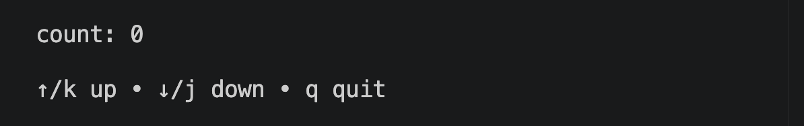
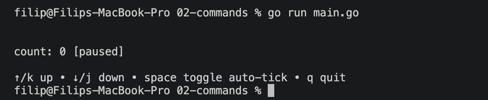
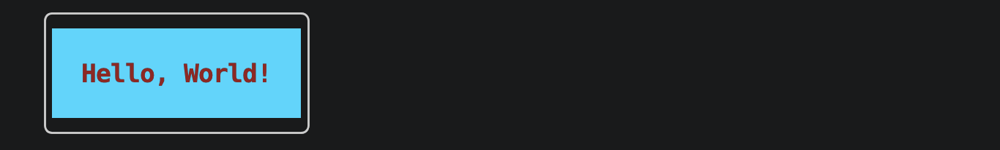
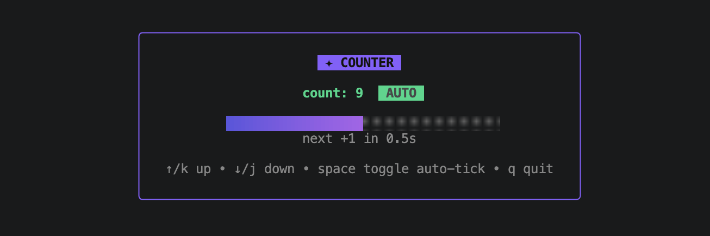

import { ElmArchitectureExplainer } from './components/elm-architecture-explainer'

When Claude Code first came out, what caught my eye was its terminal interface — the TUI. Ever since, I've wanted to build my own cool-looking TUIs. Recently, while learning Go, I came across [Bubble Tea](https://github.com/charmbracelet/bubbletea) — a Go framework for making terminal apps. In this article I'll give you a quick "how to get started" guide and walk through the core concepts behind Bubble Tea, along with some tips and tricks I've picked up along the way.

## The Elm Architecture (TEA)

Bubble Tea is based on the functional design paradigms of the [Elm Architecture](https://guide.elm-lang.org/architecture/). So before diving into making our first terminal app, it's worth introducing ourselves with this pattern.

At the core of The Elm Architecture are three concepts:

- `Model`: holds the state of your app
- `View`: displays the `Model`'s state to the user
- `Update`: listens for messages and updates the `Model` accordingly

<ElmArchitectureExplainer client:visible />

Don't worry if this doesn't fully make sense yet — it'll click once we start building. So let's get started.

## Building A Counter App TUI

We'll be creating a simple counter app. We want to display the current count in the terminal and be able to increment or decrement it using arrow keys.

Following the Elm Architecture, our program will have its own `Model`. You can technically use any type, but in practice it's almost always a `struct`. Let's think about what state our app needs to hold. It's a counter app, so it definitely needs to keep track of the `count`. Our `model` will look like this:

```go
type model struct {
	count int
}
```

Next we have to create three methods on our `model`, so that we comply with the `tea.Model` interface:

```go
type Model interface {
    Init() Cmd
    Update(Msg) (Model, Cmd)
    View() View
}
```

The first method is `Init`, which runs once when we first start the program. This method can be used for initial I/O using a command (more on those later). For now we can just return `nil`:

```go
func (m model) Init() tea.Cmd {
	return nil
}
```

The second method is `Update`, which handles incoming messages and returns the new model and a command (which for now will be `nil` as well).

But first, what are these _messages_?

A message (`tea.Msg`) is just an empty interface:

```go
type Msg interface{}
```

This means _anything_ can be a message. Messages represent "something happened" — a keypress, a window resize, data returned from an API call, etc. There are several built-in messages that Bubble Tea itself sends — the two you'll run into most often are:

- `tea.KeyPressMsg`: a key was pressed
- `tea.WindowSizeMsg`: the terminal was resized

For our app, we want to listen for the `KeyPressMsg`. If the user presses the up key or `k`, we'll increment our counter by one (and similarly with the down key or `j` we'll decrement it). We also want the user to be able to quit the program by pressing `ctrl+c` or `q` (otherwise you'd have to close the entire terminal). Here's the code for the `Update()` method to handle this:

```go
func (m model) Update(msg tea.Msg) (tea.Model, tea.Cmd) {
	switch msg := msg.(type) {

	case tea.KeyPressMsg:
		switch msg.String() {
		case "ctrl+c", "q":
			return m, tea.Quit
		case "up", "k":
			m.count++
		case "down", "j":
			m.count--
		}
	}

	return m, nil
}
```

We use `switch` statements to determine the type of the message (which, as mentioned, can be any type). If the message is of type `tea.KeyPressMsg`, calling the `String()` method on it returns the value of the key that's been pressed (`"up"` for the up arrow, `"down"` for the down arrow, or individual letter keys).

Notice what happens when we press `ctrl+c` (or `q`): we return the model (`m`) and `tea.Quit` — a built-in command that tells Bubble Tea to shut down the program's event loop. For incrementing and decrementing, we simply update the model's state and return it (with `nil` as the command because we don't need to perform any side effect yet).

The last method we need to implement is `View`. This method is responsible for rendering content based on the model's state so it can be displayed to the user. In Bubble Tea v1, the `View` method returned a string that would be printed out to the terminal, but in the current v2, this method returns a `tea.View` struct. You don't need to know much about the struct - most of the time you'll simply use the `tea.NewView(str)` function and pass in the string you want to display.

For our app, this method will look like this:

```go
func (m model) View() tea.View {
	return tea.NewView(fmt.Sprintf("count: %d\n\n↑/k up • ↓/j down • q quit\n", m.count))
}
```

The most important thing to remember is that `View()` should never mutate state or trigger side effects - all state changes happen in `Update()`.

And that's it - now we'll just add the `main()` function to start our program:

```go
func main() {
	p := tea.NewProgram(model{})
	if _, err := p.Run(); err != nil {
		os.Exit(1)
	}
}
```



For reference, here's the full code up to now:

```go collapse
package main

import (
	"fmt"
	"os"

	tea "charm.land/bubbletea/v2"
)

type model struct {
	count int
}

func (m model) Init() tea.Cmd {
	return nil
}

func (m model) Update(msg tea.Msg) (tea.Model, tea.Cmd) {
	switch msg := msg.(type) {

	case tea.KeyPressMsg:
		switch msg.String() {
		case "ctrl+c", "q":
			return m, tea.Quit
		case "up", "k":
			m.count++
		case "down", "j":
			m.count--
		}
	}

	return m, nil
}

func (m model) View() tea.View {
	return tea.NewView(fmt.Sprintf("count: %d\n\n↑/k up • ↓/j down • q quit\n", m.count))
}

func main() {
	p := tea.NewProgram(model{})
	if _, err := p.Run(); err != nil {
		os.Exit(1)
	}
}
```

## Commands

A command (`tea.Cmd`) is how Bubble Tea does anything that takes time or touches the outside world (network calls, reading files, starting timers, etc.) without blocking your UI.

A command is just a function that does some work and returns a `Msg` when it's done. Bubble Tea runs it in the background using its own [goroutine](https://go.dev/tour/concurrency/1), and once it finishes, feeds the resulting message back to `Update()`.

Just so there isn't any confusion between _messages_ and _commands_, here is a brief comparison between these two concepts:

|                     | Message (`tea.Msg`)                     | Command (`tea.Cmd`)                                      |
| ------------------- | --------------------------------------- | -------------------------------------------------------- |
| What it is          | Data describing something that happened | A function that performs an effect and returns a message |
| Type signature      | `interface{}` (`any` type)              | `func() tea.Msg`                                         |
| Purpose             | Represents an event                     | Triggers a side effect (I/O, timers, network...)         |
| Where it's consumed | `Update(msg tea.Msg, ...)`              | Executed by the Bubble Tea runtime (not by you directly) |

Let's use commands to automate our counter — let's say we want to allow the user to toggle auto-increment, which increments the counter every second.

First, let's update our model so it keeps track of whether auto-increment is enabled, using a simple `bool` variable:

```go {3}
type model struct {
	count   int
	ticking bool // added
}
```

Before writing our own command, we need to declare our own message type. Let's call it `tickMsg` — an empty struct, since we don't need any data. We only need `Update()` to receive `tickMsg` whenever it's supposed to increment the counter.

```go
type tickMsg struct{}
```

Now we'll write our own command, `doTick()`. Since `tea.Cmd` is just `func() tea.Msg`, `doTick` itself can have exactly that shape - a function that does the waiting and hands back a `tickMsg` when it's done. We'll use `time.Sleep()` to cause the one-second delay. Remember that the command runs inside a goroutine, so it won't block our app.

```go
func doTick() tea.Msg {
	time.Sleep(time.Second)
	return tickMsg{}
}
```

Let's update our `Update()` method. First, we need to listen for when the user presses the spacebar - this is how the user toggles auto-increment. When spacebar is pressed, we do two things:

- toggle the `m.ticking` state
- if `m.ticking` is now `true`, return our model `m` and our `doTick` command

```go
case tea.KeyPressMsg:
	switch msg.String() {
	case "ctrl+c", "q":
		return m, tea.Quit
	case "up", "k":
		m.count++
	case "down", "j":
		m.count--
	case "space":
		m.ticking = !m.ticking
		if m.ticking {
			return m, doTick
		}
	}
```

Notice one thing: we're not actually invoking `doTick()` when we return it. Instead, we're just handing Bubble Tea a reference to the function itself. Bubble Tea's runtime then calls it for you, in its own goroutine, and whenever it finishes, feeds the resulting `tea.Msg` back into `Update()`.

But what if the command needs a parameter? For example, what if we didn't want to hardcode a delay of 1 second, but instead pass the delay time as an argument to the command? The solution is to wrap the command inside another function that takes your argument and returns the command:

```go
func doTick(d time.Duration) tea.Cmd {
	return func() tea.Msg {
		time.Sleep(d)
		return tickMsg{}
	}
}
```

Then inside `Update()` we would call it like this:

```go
case tickMsg:
	if !m.ticking {
		return m, nil
	}
	m.count++
	return m, doTick(time.Second)
```

Note the shift: `doTick` went from being a `tea.Cmd` itself to being a command **factory** — a plain function that returns a closure, which captures `d` (our passed delay argument) and only runs when the runtime actually invokes it. Because it's now a factory, you have to call it (`doTick(time.Second)`) rather than pass it bare.

_A side note:_ the same behavior could be accomplished using the built-in `tea.Tick()` function, which adds a couple of niceties (it uses a proper timer instead of a blocking `time.Sleep()`, and it can be cleaned up if the program quits mid-wait).

```go
func doTick() tea.Cmd {
	return tea.Tick(time.Second, func(t time.Time) tea.Msg {
		return tickMsg{}
	})
}
```

Just keep in mind that this version is a factory too (it returns a `tea.Cmd`, not a `tea.Msg` directly), so you'd call it as `doTick()` rather than pass it bare, the same way we called `doTick(time.Second)` above. Aside from that, it doesn't really matter which version you use.

Ok, back to our app. Right now we're only listening for `tea.KeyPressMsg`, but our `doTick` command returns a `tickMsg` — so let's add a switch case for that type too. We check whether `m.ticking` is still on (the user could've toggled auto-increment off during the one second before the command returns a message) and, if so, increment the counter and return our model plus the `doTick` command so the auto-increment keeps going.

Here is the full `Update()` code:

```go
func (m model) Update(msg tea.Msg) (tea.Model, tea.Cmd) {
	switch msg := msg.(type) {

	case tea.KeyPressMsg:
		switch msg.String() {
		case "ctrl+c", "q":
			return m, tea.Quit
		case "up", "k":
			m.count++
		case "down", "j":
			m.count--
		case "space":
			m.ticking = !m.ticking
			if m.ticking {
				return m, doTick
			}
		}

	case tickMsg:
		if !m.ticking {
			// Toggled off while a tick was already in flight; drop it.
			return m, nil
		}
		m.count++
		return m, doTick // re-issue the next tick to keep it recurring
	}

	return m, nil
}
```

Notice that if we didn't return the `doTick` command, whenever the user toggles auto-increment on, the counter would only increment once and then stopped.

Finally, let's make a small change to our `View()` method:

```go
func (m model) View() tea.View {
	state := "paused"
	if m.ticking {
		state = "ticking"
	}
	return tea.NewView(fmt.Sprintf(
		"count: %d [%s]\n\n↑/k up • ↓/j down • space toggle auto-tick • q quit\n",
		m.count, state,
	))
}
```

And we're ready to run it.

![The counter app with auto-increment running, showing "count: 24 [ticking]" and the updated key hints](./images/counter-app-auto-tick.png)

## Alt Screen

Right now, when we run our app, the rendered text is just appended to the terminal, with whatever we ran before still visible above it. Also, when you quit the app, the last thing that was printed stays on screen.



To make our app feel a bit more "professional", we can use an alt screen (alternate screen buffer). This gives our program a separate, full-screen terminal canvas to draw on without disturbing whatever was there before. With alt screen enabled, opening the app clears the terminal to a blank full-screen view, and closing it restores the previous shell content exactly as it was.

To enable alt screen, we simply set the `AltScreen` field on our `tea.View` to `true`:

```go {11}
func (m model) View() tea.View {
	state := "paused"
	if m.ticking {
		state = "ticking"
	}
	v := tea.NewView(fmt.Sprintf(
		"count: %d [%s]\n\n↑/k up • ↓/j down • space toggle auto-tick • q quit\n",
		m.count, state,
	))

	v.AltScreen = true // enable alt screen

	return v
}
```

It's a one-line change, but it really elevates your app.

## Logging

Being able to log things and state is crucial for debugging. There's one problem, though: because our program is occupying the terminal, we can't log to stdout.

Fortunately, we can still log to a file — in our case, a `debug.log` file. To enable this, we'll route all logs to this file in our `main()` function, using [charmbracelet/log](https://github.com/charmbracelet/log) — a drop-in replacement for the standard library logger that adds leveled methods like `Info` and `Error`:

```go {2-8}
func main() {
	f, err := os.OpenFile("debug.log", os.O_CREATE|os.O_WRONLY|os.O_APPEND, 0644)
	if err != nil {
		fmt.Fprintln(os.Stderr, "could not open debug.log:", err)
		os.Exit(1)
	}
	defer f.Close()
	log.SetOutput(f)

	p := tea.NewProgram(model{})
	if _, err := p.Run(); err != nil {
		log.Error("program exited with error", "err", err)
		os.Exit(1)
	}
}
```

To see how this works, let's log every time the user presses the space bar:

```go {3}
case "space":
	m.ticking = !m.ticking
	log.Info("ticking toggled", "ticking", m.ticking) // logged to debug.log file
	if m.ticking {
		return m, doTick
	}
```

If you open `debug.log` in the root folder, you'll see something like this:

```log
2026/07/02 14:29:16 INFO ticking toggled ticking=true
2026/07/02 14:29:23 INFO ticking toggled ticking=false
2026/07/02 14:29:25 INFO ticking toggled ticking=true
```

To watch the log in real time, run `tail -f debug.log` from another terminal window.

## Full Code

Here is the full code of our little counter TUI:

```go collapse
package main

import (
	"fmt"
	"os"
	"time"

	tea "charm.land/bubbletea/v2"
	"github.com/charmbracelet/log"
)

type tickMsg struct{}

type model struct {
	count   int
	ticking bool
}

func doTick() tea.Msg {
	time.Sleep(time.Second)
	return tickMsg{}
}

func (m model) Init() tea.Cmd {
	return nil
}

func (m model) Update(msg tea.Msg) (tea.Model, tea.Cmd) {
	switch msg := msg.(type) {

	case tea.KeyPressMsg:
		switch msg.String() {
		case "ctrl+c", "q":
			return m, tea.Quit
		case "up", "k":
			m.count++
		case "down", "j":
			m.count--
		case "space":
			m.ticking = !m.ticking
			log.Info("ticking toggled", "ticking", m.ticking) // logged to debug.log file
			if m.ticking {
				return m, doTick
			}
		}

	case tickMsg:
		if !m.ticking {
			return m, nil
		}
		m.count++
		return m, doTick
	}

	return m, nil
}

func (m model) View() tea.View {
	state := "paused"
	if m.ticking {
		state = "ticking"
	}
	v := tea.NewView(fmt.Sprintf(
		"count: %d [%s]\n\n↑/k up • ↓/j down • space toggle auto-tick • q quit\n",
		m.count, state,
	))

	v.AltScreen = true // enable alt screen

	return v
}

func main() {
	f, err := os.OpenFile("debug.log", os.O_CREATE|os.O_WRONLY|os.O_APPEND, 0644)
	if err != nil {
		fmt.Fprintln(os.Stderr, "could not open debug.log:", err)
		os.Exit(1)
	}
	defer f.Close()
	log.SetOutput(f)

	p := tea.NewProgram(model{})
	if _, err := p.Run(); err != nil {
		log.Error("program exited with error", "err", err)
		os.Exit(1)
	}
}
```

## Next Steps

Now you have all the ingredients to start making awesome-looking TUIs. But as they say:

> Don't reinvent the wheel.

So here are two popular libraries from the Bubble Tea ecosystem that make building TUIs much easier.

### [Lip Gloss](https://github.com/charmbracelet/lipgloss)

If you wanted to add colors to your TUI on your own, you'd have to hardcode ANSI escape codes into your output strings which is very tedious. Fortunately, there's a companion styling library for TUIs called Lip Gloss — think of it as "CSS for the terminal." Besides colors, it also handles things like:

- borders
- padding
- margins
- alignment
- layout

It does all this through a declarative, chainable API. You build a `Style` and apply it to a string:

```go
import "charm.land/lipgloss/v2"

style := lipgloss.NewStyle().
	Bold(true).
	Foreground(lipgloss.Color("#d52a2a")).
	Background(lipgloss.Color("#0ed7ff")).
	Padding(1, 2).
	Border(lipgloss.RoundedBorder())

fmt.Println(style.Render("Hello, World!"))
```



### [Bubbles](https://github.com/charmbracelet/bubbles)

Another library you'll find handy is Bubbles — a collection of pre-built, reusable UI components for Bubble Tea. Here are some examples of what's included:

- `textinput`: a single-line text field with cursor, placeholder text, and validation
- `list`: a scrollable, filterable list with built-in pagination
- `viewport`: a scrollable content pane
- `spinner`: animated loading indicators
- `progress`: progress bars

Each Bubbles component is itself a Bubble Tea model — you embed it in your own model, forward relevant messages to it, and render its output as part of your `View`.

Here is a quick example of our TUI, slightly enhanced using these two libraries — treat it as a preview to skim rather than something to trace line-by-line, it leans on a few APIs (like `lipgloss.Place`/`Join*` for layout and `tea.WindowSizeMsg` for sizing) we haven't walked through:



```go collapse
package main

import (
	"fmt"
	"os"
	"time"

	"charm.land/bubbles/v2/progress"
	tea "charm.land/bubbletea/v2"
	"charm.land/lipgloss/v2"
	"github.com/charmbracelet/log"
)

const (
	tickDelay     = time.Second
	frameInterval = 50 * time.Millisecond
	barWidth      = 36
)

var (
	containerStyle = lipgloss.NewStyle().
			Border(lipgloss.RoundedBorder()).
			BorderForeground(lipgloss.Color("99")). // purple
			Padding(1, 3)

	titleStyle = lipgloss.NewStyle().
			Bold(true).
			Foreground(lipgloss.Color("230")).
			Background(lipgloss.Color("99")).
			Padding(0, 1)

	countStyle = lipgloss.NewStyle().Bold(true).Foreground(lipgloss.Color("42")) // green

	autoBadgeStyle = lipgloss.NewStyle().
			Bold(true).
			Foreground(lipgloss.Color("0")).
			Background(lipgloss.Color("42")).
			Padding(0, 1)

	pausedBadgeStyle = lipgloss.NewStyle().
				Bold(true).
				Foreground(lipgloss.Color("230")).
				Background(lipgloss.Color("240")).
				Padding(0, 1)

	labelStyle = lipgloss.NewStyle().Foreground(lipgloss.Color("245"))
	helpStyle  = lipgloss.NewStyle().Foreground(lipgloss.Color("240"))
)

type model struct {
	count   int
	ticking bool
	lastTick time.Time
	elapsed  time.Duration
	width, height int
	progressBar progress.Model
}

func initialModel() model {
	return model{
		progressBar: progress.New(
			progress.WithDefaultBlend(),
			progress.WithWidth(barWidth),
			progress.WithoutPercentage(),
		),
	}
}

func (m model) Init() tea.Cmd {
	log.Info("program started")
	return nil
}

type frameMsg time.Time

func doFrame() tea.Cmd {
	return tea.Tick(frameInterval, func(t time.Time) tea.Msg {
		return frameMsg(t)
	})
}

func (m model) Update(msg tea.Msg) (tea.Model, tea.Cmd) {
	switch msg := msg.(type) {

	case tea.WindowSizeMsg:
		m.width = msg.Width
		m.height = msg.Height

	case tea.KeyPressMsg:
		switch msg.String() {
		case "ctrl+c", "q":
			log.Info("quitting")
			return m, tea.Quit
		case "up", "k":
			m.count++
			log.Info("incremented", "count", m.count)
		case "down", "j":
			m.count--
			log.Info("decremented", "count", m.count)
		case "space":
			m.ticking = !m.ticking
			log.Info("ticking toggled", "ticking", m.ticking)
			if m.ticking {
				m.lastTick = time.Now()
				m.elapsed = 0
				return m, doFrame()
			}
		}

	case frameMsg:
		if !m.ticking {
			return m, nil
		}
		m.elapsed = time.Time(msg).Sub(m.lastTick)
		if m.elapsed >= tickDelay {
			m.count++
			m.lastTick = time.Time(msg)
			m.elapsed = 0
			log.Info("tick", "count", m.count)
		}
		return m, doFrame()
	}

	return m, nil
}

func (m model) View() tea.View {
	badge := pausedBadgeStyle.Render("PAUSED")
	barLabel := labelStyle.Render("space starts auto-increment")
	percent := 0.0
	if m.ticking {
		badge = autoBadgeStyle.Render("AUTO")
		percent = min(float64(m.elapsed)/float64(tickDelay), 1)
		remaining := max(tickDelay-m.elapsed, 0)
		barLabel = labelStyle.Render(fmt.Sprintf("next +1 in %.1fs", remaining.Seconds()))
	}

	body := lipgloss.JoinVertical(lipgloss.Center,
		titleStyle.Render("✦ COUNTER"),
		"",
		lipgloss.JoinHorizontal(lipgloss.Center,
			countStyle.Render(fmt.Sprintf("count: %d", m.count)),
			"  ",
			badge,
		),
		"",
		m.progressBar.ViewAs(percent),
		barLabel,
		"",
		helpStyle.Render("↑/k up • ↓/j down • space toggle auto-tick • q quit"),
	)

	v := tea.NewView(lipgloss.Place(
		m.width, m.height,
		lipgloss.Center, lipgloss.Center,
		containerStyle.Render(body),
	))

	v.AltScreen = true

	return v
}

func main() {
	f, err := os.OpenFile("debug.log", os.O_CREATE|os.O_WRONLY|os.O_APPEND, 0644)
	if err != nil {
		fmt.Fprintln(os.Stderr, "could not open debug.log:", err)
		os.Exit(1)
	}
	defer f.Close()
	log.SetOutput(f)

	p := tea.NewProgram(initialModel())
	if _, err := p.Run(); err != nil {
		log.Error("program exited with error", "err", err)
		os.Exit(1)
	}
}
```

### [Bubblon](https://github.com/donderom/bubblon)

Finally, I'd like to mention one third-party library called Bubblon that I've used extensively. As your app grows, you might want to start thinking about parts of your app as different independent models. Bubblon makes it easy to manage these independent nested models. There's a really good [article by Roman Parykin](https://donderom.com/posts/managing-nested-models-with-bubble-tea/) explaining how to manage nested models in Bubble Tea, which is definitely worth reading.

One thing I've encountered though — it seems that Bubblon is currently only supporting Bubble Tea v1 (which has some type differences with v2). Fortunately, Bubblon is a [single file](https://github.com/donderom/bubblon/blob/main/controller.go), so what I ended up doing is creating my own `bubblon` package inside my project, copying the `controller.go` file into it, and manually updating it to make it compatible with Bubble Tea v2 (the `View()` method returns `tea.View` instead of a string, plus a couple more small changes, but nothing too difficult). A coding agent handles the port without much trouble.

## Conclusion

In this article, we built a simple counter app TUI, which walked us through the main building blocks of Bubble Tea, a Go framework for building modern TUIs. We started with The Elm Architecture, the pattern Bubble Tea is built on. Then we handled user input and updated our model accordingly, which was rendered to the terminal for the user to see. From there we got familiar with commands, which let us run long-lasting tasks without blocking the app, made our app full-screen with the alt screen, and set up file logging for debugging. Finally, we looked at Lip Gloss and Bubbles - two libraries that take your TUI from "it works" to "it looks great".
