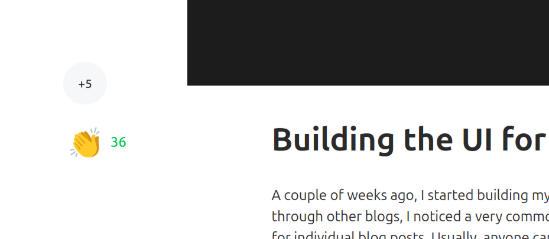
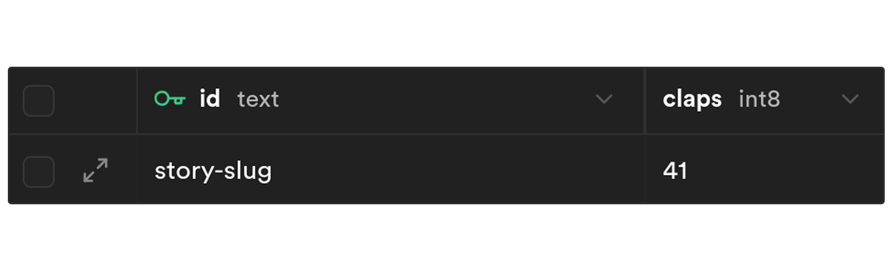
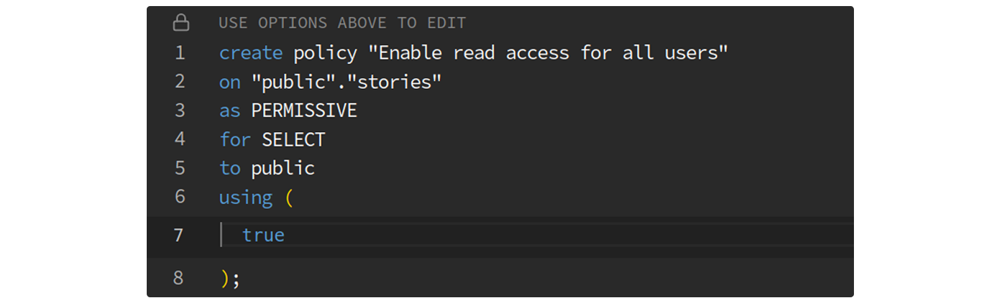

---
banner:
  alt: Banner
  image: ./banners/banner.gif
description: I wanted to add a 'claps' feature to my blog — so I built my own button
  using SolidJS and Supabase. No auth, no server — just a fun little project that
  turned into a full-stack learning experience.
pubDate: 2025-03-24
slug: adding-claps-feature
tags:
- Math
- Pi
- MonteCarloMethod
title: "Adding a Claps\U0001F44F Feature to My Blog"
updatedDate: null
---

import Quote from '../components/solid/Quote'
import Callout from '../components/solid/Callout'
import Code from '../components/solid/Code'
import ClapsDemo from '../components/solid/ClapsDemo'

A couple of weeks ago, I started building my own blog using [Astro](https://astro.build/). As I was scrolling through other blogs, I noticed a very common feature — _claps_ or some sort of _like_ button for individual blog posts. Usually, anyone can click these buttons without having to sign in or provide any credentials. Also, because you don’t have to be authenticated, you can often click the _claps_ button as many times as you want.

So, I decided to give it a go and recreate this feature for my blog.

The goal is to create a claps button with the following features:

- **Anyone can use it** (no authentication required)
- **You can _clap_ a maximum of 99 times at once** (I think that’s enough)
- **The _claps_ are stored in a database**

I've split up this post into two parts - in par 1, I'll walk you through how I built the UI for the claps button and in part 2 we'll dive into the backend, where I'll show you how I store the claps in a database.

## Pat 1: UI

### Choosing the Tech Stack

One thing I love about Astro is that it’s frontend-framework agnostic — you can plug in React, Vue, Svelte, Solid, etc. For this project, I picked [SolidJS](https://www.solidjs.com/). I’d never used it before, and this seemed like a fun opportunity to try it out.

Solid is a lightweight, reactive framework that’s perfect for small, interactive UI components like this one. It also integrates seamlessly with Astro - all you need to do to add Solid to your project is run:

<Code client:visible>

```bs
npx astro add solid
```

</Code>

### Designing the Button

Since I’m not a designer, I started simple — a `<button>` with a 👏 emoji.

<ClapsDemo client:load includeBubble={false} includeDebounce={false} />

Okay, that was maybe too simple. So I leveled it up a bit:

- Added some basic styling with Tailwind:
  - `hover:scale-125` to make it pop on hover
  - `transition-transform duration-200` to animate it smoothly
- Introduced a little **“claps counter bubble”** that shows how many times you’ve clicked

<ClapsDemo client:load includeBubble={true} includeDebounce={false} />

### Adding Interactivity with Debounce⏱️

Now I had a new challenge: **When should the bubble disappear?**

That's where **debounce** comes in. According to ChatGPT:

<Quote quote="Debounce is a technique to delay execution until some time has passed without additional action." />

In my case, I wanted the bubble to:

- Stay visible while the user is clicking repeatedly
- Disappear **1.5 seconds after the last click**
- **Send the total claps to the backend only once**

In my case, I need to call a `hideBubble()` function when you stop hitting the _claps_ button. Let’s say that if you don’t click the button within 1.5 seconds since your last click, I consider that as you stopped clicking.

To achieve this, I use a debounce function:

<Code client:visible>

```ts
function debounce(func: Function, timeout: number) {
	let timer: NodeJS.Timeout
	return () => {
		if (timer) clearTimeout(timer)
		timer = setTimeout(() => {
			func()
		}, timeout)
	}
}
```

</Code>

I use this `debounce()` function as a wrapper for my `hideBubble()` function:

<Code client:visible>

```ts
const hideBubble = debounce(() => {
	// hide the "buble"
	// send a request to the backend
}, 1500)
```

</Code>

Every time the user clicks, `hideBubble()` is called — but only _executed_ once the user stops clicking for 1.5 seconds.

> Want to learn more about debounce? [_Here’s a great article_](https://www.freecodecamp.org/news/javascript-debounce-example/) that explains it.

This approach improves performance and user experience — instead of spamming the server with 99 requests, I just send one.

<ClapsDemo client:load includeBubble={true} includeDebounce={true} />

The final result is a simple yet interactive button that provides real-time feedback to users as they click. If you're reading this article on your phone, you'll find the button at the very bottom of this article. If you're reading it on a larger device, you'll see the button on the top-left of this article.



Well, now you might be wondering: "ok, but what database?"🤔

I'm glad you asked...

## Part 2: Backend - Where Do the Claps Go?

For storing claps, I went with [Supabase](https://supabase.com/) — an open-source Firebase alternative that uses **PostgreSQL** under the hood.

Supabase comes with:

- Authentication & Authorization
- Realtime Database
- Edge Functions
- Storage  
  ...and more. But for this feature, I only needed a simple database table.

I created a `stories` table with two columns:

- `id`: the story slug, which I'm using as its ID
- `claps`: number of claps



Okay that all sounds easy, but here’s the catch:

> I’m hosting my blog on **GitHub Pages**, which doesn’t support server-side code or API endpoints.

So how do I securely send data to Supabase from the frontend?

That’s where **Row Level Security (RLS)** saves the day.

### Setting up Row Level Security🔐

[RLS](https://supabase.com/docs/guides/database/postgres/row-level-security) is a security feature in databases that controls which rows in a table a user can access.

> The main idea is that RLS allows you to enforce fine-grained access control at the database level, so you don't have to rely solely on API security.

By enabling RLS I don’t have to worry about exposing my **API Key** on the client side. Even if someone tries sending requests using my API Key, they won’t be able to perform actions that I haven’t allowed.

Supabase makes RLS super easy to implement  - here's how I set it up:

- Enabled RLS in the Supabase dashboard.
- Added a policy: **“Enable read access for all users”** (I used a pre-made template but you can write your own [PostgreSQL policies](https://supabase.com/docs/guides/database/postgres/row-level-security#policies))
- Done.



And just like that, anyone is allowed to view my `stories` table, but no one can `INSERT`, `UPDATE`, or `DELETE` any row. Now, I can **send requests directly from the client side** using my public key without worrying about someone messing with my data.

![[Pasted image 20250319134543.png]]

<Callout>

The RLS policies affect _visibilities_. With no policies in place for `INSERT`, `UPDATE`, `DELETE`, they all "see" an empty table. If you try to `INSERT` a new row, you'll get an error. But if you try to `UPDATE` or `DELETE`, you'll get a response with 204 (No Content) status, because no rows were found to delete or update. This might come as a surprise, but it is the intended behavior (for security reasons).

</Callout>

But wait — if no one can `UPDATE` any row, how will I add the _claps_ after a user clicks the button? That’s where **Database Functions** come in.

### Using database function to update Claps👏

[Database functions](https://supabase.com/docs/guides/database/functions) (also called **stored procedures**) are reusable bits of SQL code that run on the database side. They allow you to **run a sequence of SQL operations** (e.g., insert + update + select), and more importantly for me, **perform custom validations or calculations**.

Here’s the function I wrote:

<Code client:visible>

```sql
CREATE OR REPLACE FUNCTION increment_claps(increment_by int, story_id text)
RETURNS void
LANGUAGE plpgsql
SECURITY DEFINER
SET search_path = ''
AS
$$
BEGIN
    IF increment_by < 1 OR increment_by > 99 THEN
        RAISE EXCEPTION 'Number of claps must be between 1 and 99';
    END IF;
    UPDATE public.stories
    SET claps = claps + increment_by
    WHERE id = story_id;
END;
$$;
```

</ Code >

This function takes in the number of claps to add (`increment_by`) and the ID of the story to update (`story_id`). It checks that the number of claps is between 1 and 99, and then updates the `stories` table.

Key part: `SECURITY DEFINER` — it allows the function to **bypass all RLS policies**. It is a special setting you can apply to a **database function** that basically tells the database:

<Quote
	quote="When someone calls this function, execute it as if the creator of the function is running it — not the person actually calling it."
	includeQuotes={true}
/>

This means that even though users can’t directly update the table, they can call this function to increment the claps.

From the frontend, I call it using the Supabase JS SDK:

<Code client:visible>

```ts
await supabase.rpc('increment_claps', {
	increment_by: 5,
	story_id: 'story-slug'
})
```

</Code>

Simple and (hopefully) secure.

## Challenges And Future Improvements

Even though I’m pleased with the final result, there are a couple of issues I’d like to tackle in the future:

1. **Manually Inserting Table Rows**: I currently have to manually insert a row for each new blog post. Automating this with a GitHub Action would be a nice upgrade.
2. **Rate Limiting**: There’s no real limit on how often someone can clap (except 99 per batch). If you want to spam me with claps — go for it while you can!
3. **Unsaved Changes When Closing the Browser**: If you close the browser before the 1.5-second debounce finishes, claps aren’t saved. I’ll need to find a solution for this in the future.

## Final Thoughts

This was a fun little project that turned into a great learning experience — from SolidJS on the frontend to RLS and stored procedures on the backend.

The result is a claps feature that’s:

- Lightweight
- Interactive
- Serverless
- Secure

There’s still room for improvement, but that’s part of the fun.