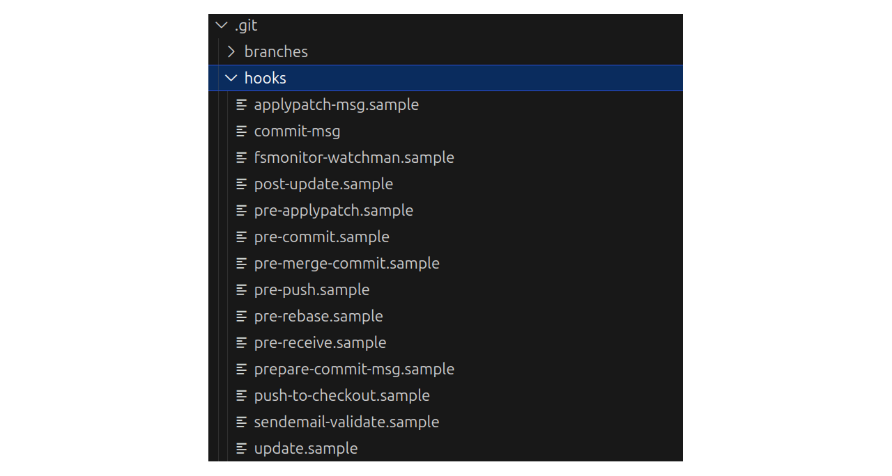
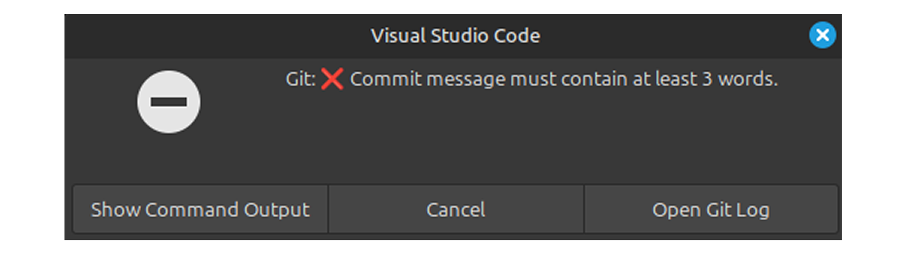
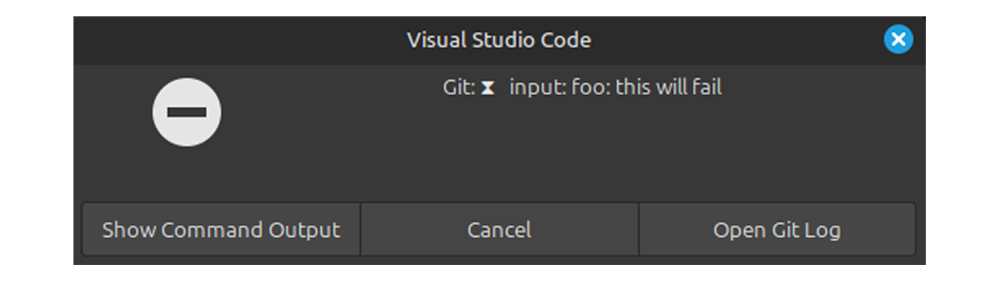

## TL;DR

```sh
# Start a new project
npm init -y
git init

# Set up Husky
npm install --save-dev husky
npx husky init

# Set up Commitlint
npm install --save-dev @commitlint/config-conventional @commitlint/cli

# Commitlint config (ES modules)
echo "export default { extends: ['@commitlint/config-conventional'] };" > commitlint.config.js

# Add commit-msg hook
npx husky add .husky/commit-msg "npx --no -- commitlint --edit \$1"
```

## Introduction To Conventional Commits

Some time ago, I came across an article about writing better commit messages, which introduced me to Conventional Commits: a simple, standardized way to format commit messages.

The basic syntax looks like this:

```
<type>[optional scope]: <description>

[optional body]

[optional footer(s)]
```

Some common commit `type`s include:

- `feat` – a new feature
- `fix` – a bug fix
- `docs` – documentation changes
- `perf` – performance improvements

Conventional Commits help you:

- Keep commit history readable
- Generate changelogs automatically
- Enable semantic versioning
- Enforce consistency across teams

In this article, we'll see how to **enforce Conventional Commit messages automatically** using **Git hooks**, **Husky**, and **commitlint**.

## Project Setup

Let's start by creating a new JavaScript project and initializing a Git repository:

```sh
npm init -y
git init
```

Before enforcing anything, we need to understand the mechanism that makes this possible: **Git hooks**.

## What Are Git Hooks?

Git hooks are scripts that Git automatically runs when certain events occur, such as:

- `pre-commit`
- `commit-msg`
- `pre-push`
- `post-checkout`
- and more

These scripts live in the `.git/hooks/` directory.

If you want to see the `.git` folder in VS Code, go to **Settings → Workspace → Files: Exclude** and remove the `.git` pattern.

Every Git repository comes with example hook files ending in `.sample`. Git ignores these files unless they are renamed.



### A simple `commit-msg` hook example

To understand how hooks work, let’s write a very simple `commit-msg` hook that enforces commit messages to be **at least three words long**.

Rename the `commit-msg.sample` to `commit-msg` and replace the contents with the following:

```sh
#!/bin/sh

COMMIT_MSG_FILE="$1"

# Read commit message, strip comments and empty lines
COMMIT_MSG=$(sed '/^#/d;/^[[:space:]]*$/d' "$COMMIT_MSG_FILE" | tr '\n' ' ')

# Count words
WORD_COUNT=$(printf "%s\n" "$COMMIT_MSG" | wc -w | tr -d ' ')

if [ "$WORD_COUNT" -lt 3 ]; then
  echo "❌ Commit message must contain at least 3 words."
  echo "   Current message: \"$COMMIT_MSG\""
  exit 1
fi

exit 0
```

Now try committing with a short message like `fix bug`. Git will reject the commit and show an error message.



At this point, you might be wondering:

> Why not just use Git hooks on their own?

There are a few problems with raw Git hooks:

- **They are not versioned**
  - the `.git/hooks` directory is ignored by Git, so hooks aren't shared when someone clones the repository
- **Manual setup for every developer**
  - Each team member has to install and maintain hooks themselves
- **OS and shell inconsistencies**
  - Hooks written for one environment may break in another

To solve these problems, we'll use **Husky**.

## What Is Husky?

[Husky](https://typicode.github.io/husky/) is a Git hooks manager that:

- Stores hook scripts inside your repository
- Automatically installs them into `.git/hooks`
- Works cross-platform
- Uses local `node_modules` binaries

With Husky, hooks live in the `.husky/` directory, which _is_ committed to Git and shared with your team.

### Installing Husky

First, install Husky as a development dependency:

```sh
npm install --save-dev husky
```

Then initialize it:

```sh
npx husky init
```

This does two things:

- Creates a `.husky/` directory with an example `pre-commit` hook
- Adds a `prepare` script to `package.json`

```json
"scripts": {
	"prepare": "husky"
}
```

The `prepare` script ensures Husky hooks are reinstalled automatically after `npm install`.

You can delete the default `pre-commit` hook if you don’t need it.

### Enforcing conventional commits with commitlint

Instead of writing our own validation logic, we’ll use [commitlint](https://commitlint.js.org/), a tool designed specifically for linting commit messages.

Install commitlint and its Conventional Commits configuration:

```sh
npm install --save-dev @commitlint/config-conventional @commitlint/cli
```

Next, create a `commitlint.config.js` file:

```sh
echo "export default {extends: ['@commitlint/config-conventional']};" > commitlint.config.js
```

Because this uses ES module syntax, make sure your `package.json` includes:

```json
{
  "type": "module"
}
```

Alternatively, you can use CommonJS syntax if you prefer.

### Adding the `commit-msg` hook with Husky

Now we need to tell Husky to run commitlint whenever a commit message is created.

Use Husky’s helper command:

```sh
npx husky add .husky/commit-msg "npx --no -- commitlint --edit \$1"
```

This creates a `.husky/commit-msg` hook that runs commitlint against the commit message before the commit is finalized.

### Trying it out

Now try committing with an invalid Conventional Commit message:

```sh
git commit -m "foo: this will fail"
```

As you can see, commitlint will reject the commit:



## Conclusion

By combining **Git hooks**, **Husky**, and **commitlint**, we get the best of all worlds:

- Consistent, readable commit messages
- Zero manual setup for teammates
- Cross-platform support
- Enforcement baked directly into your workflow
