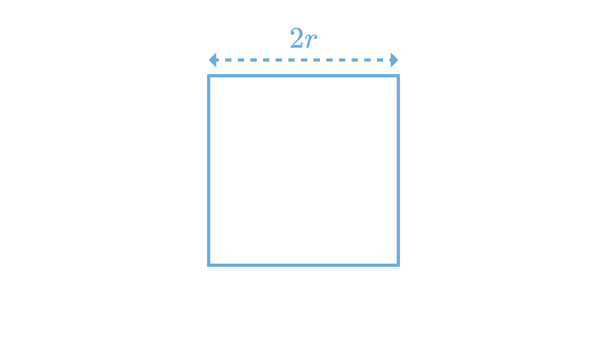
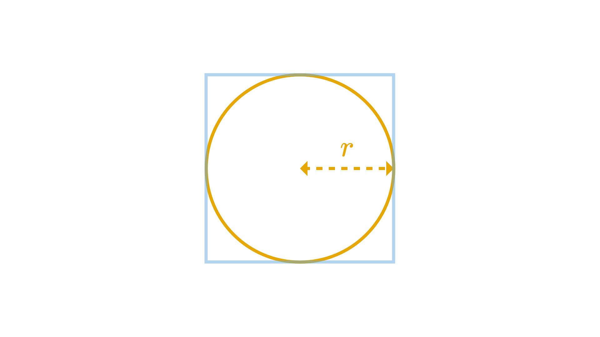
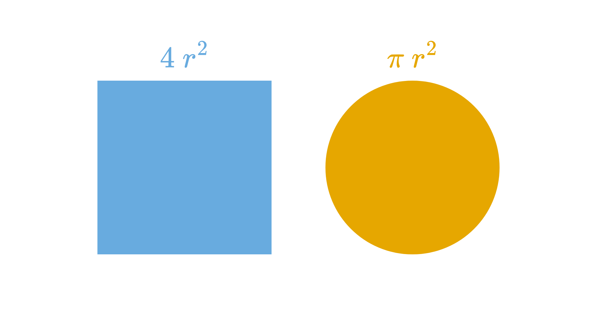
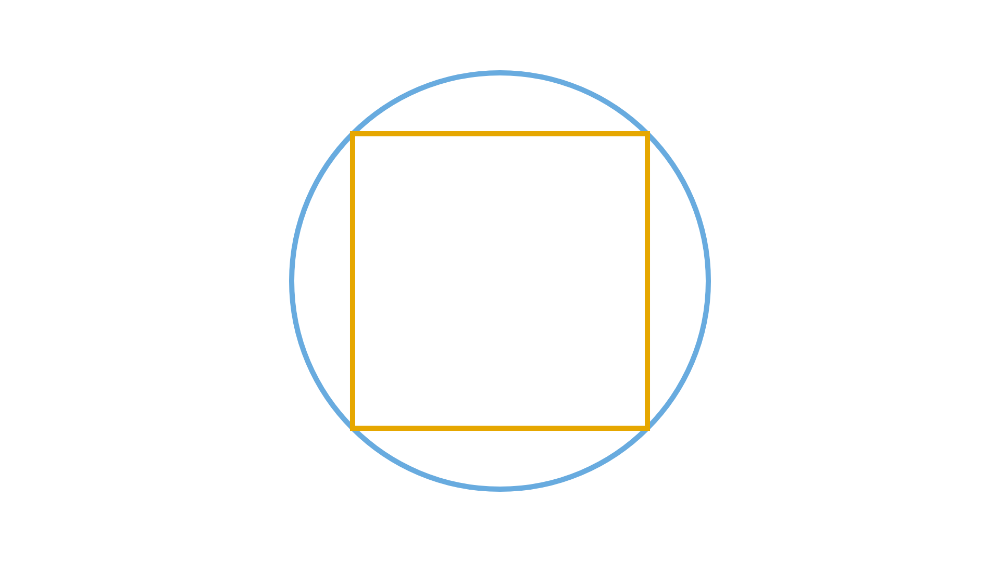

import Quote from '../components/solid/Quote'
import Callout from '../components/solid/Callout'
import MonteCarloPoint from '../components/svelte/MonteCarloPoint.svelte'
import MonteCarlo from '../components/svelte/MonteCarlo.svelte'
import MonteCarloPoints from '../components/svelte/MonteCarloPoints.svelte'
import Quiz from '../components/solid/Quiz'

Pi ($\pi$) is one of the most iconic numbers in mathematics. It pops up everywhere — from circles and spirals to ocean waves and sand dunes.

We all remember its approximate value of 3.14 from high school, but have you ever wondered how we can estimate it?

Don’t worry — we won’t be diving into complex geometry or calculus. Instead, we’ll use something surprisingly simple yet fascinating: **randomness**.

Sounds cool? Let’s dive in!

## Using Monte Carlo Method

The **Monte Carlo method** is a class of algorithms that rely on repeated random sampling to obtain numerical results. It was invented by Stanisław Ulam, a mathematician, nuclear physicist, and computer scientist.

<Callout>

The method’s name comes from the Monte Carlo Casino in Monaco, reflecting the role of chance in the process. 🎲

</Callout>

Here’s how we can use the Monte Carlo method to estimate $\pi$:

Imagine a square with a side of length $2r.$

Now, imagine a circle perfectly inscribed inside the square (touching all four sides), with a radius $r.$

We know that:

- The area of the square is $4r^2.$
- The area of the circle is $\pi r^2.$

### The power of randomness

Now imagine placing points **randomly and uniformly** within the square. Some of the points will end up inside the circle (represented by <MonteCarloPoint size="sm" color="green"/>), and some outside of it (represented by <MonteCarloPoint size="sm" color="red"/>).

<MonteCarloPoints client:idle />

Now, let's ask:

<Quote quote="What is the probability that a point lands inside the circle?" />

Since we’re placing points uniformly across the square, the chance of a point landing in a particular region is proportional to the **area** of that region. So, the probability of landing inside the circle is simply the ratio of the area of the circle to the area of the square:

So, the probability of a point ending up inside the circle is $\frac{\pi}{4}.$

Here’s the trick: by **counting** how many points land inside the circle and dividing by the total number of points, we can approximate this probability.

$$
\frac{Points\ in\ the\ Circle}{Total\ number\ of\ points}\approx \frac{\pi}{4}
$$

Multiply that ratio by 4, and we get an estimate of $\pi$:

$$
\pi \approx 4 \times \frac{Points\ in\ the\ Circle}{Total\ number\ of\ points}
$$

With enough randomly placed points, we get a pretty good approximation of $\pi$ — without any complex math!

<MonteCarlo client:idle />

<Callout>

The Monte Carlo method works because of the [law of large numbers](https://en.wikipedia.org/wiki/Law_of_large_numbers), which says that as we collect more random data, our results will get closer to the expected value.

</Callout>

## Try It Yourself

Want to try this yourself? Here’s how:

**What you need:**

- A square sheet of paper
- A circle drawn inside the square (touching all sides)
- Small objects to toss (beans, rice grains, paper bits, etc.)

**What to do:**

1. Toss the objects randomly onto the square.
2. Count how many land **inside the circle**.
3. Count the **total number of tosses**.
4. Use the formula: **$\pi$ ≈ 4 × (Inside Circle / Total Tosses)**

The more “points” you toss, the closer your estimate will be to the true value of $\pi$!

## Little Test at the End

OK now is your turn - what happens if you inscribe a square _inside_ a circle (instead of a circle inside a square)?

We have the following setup:

- The **circle** now becomes the larger shape — everything happens _within_ it.
- A **square** is inscribed inside this circle, meaning all four corners of the square touch the circle.
- We're still going to place **random points inside the circle**, but now we want to know how many land **inside the square** instead.

<Quiz
	client:load
	questions={[
		{
			question: 'How would you estimate Pi using this setup?',
			correctAnswer: '2 x (Total Points / Points Inside Square)',
			options: [
				'2 x (Points Inside Square / Total Points)',
				'Total Points / Points Inside Square',
				'Points Inside Square / Total Points'
			]
		}
	]}
/>

## Final Thoughts

Isn’t it fascinating that such a mysterious number like $\pi$ can be estimated using nothing but randomness? While this method isn’t the most efficient (you’d need millions of tosses for high precision), it’s a fun and intuitive introduction to the Monte Carlo method.
