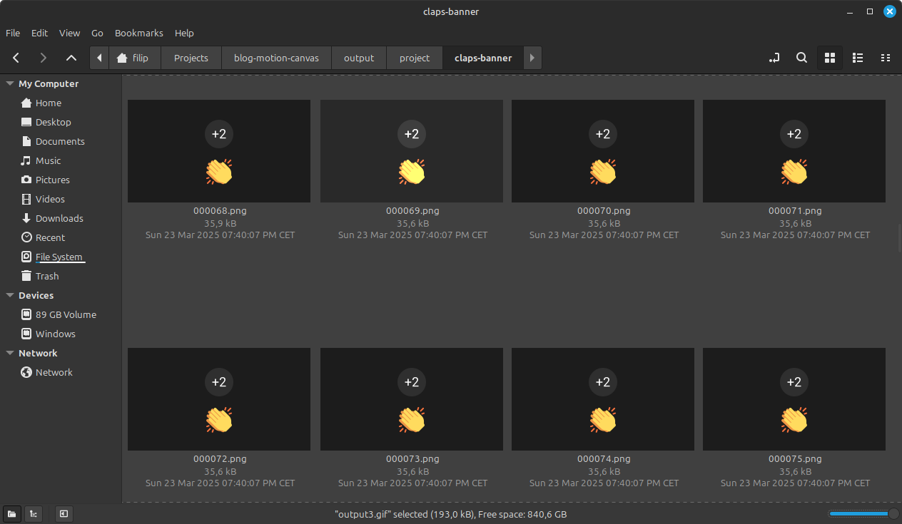

---
banner:
  alt: Banner
  image: ./banners/ghost.gif
description: In this article, I share what I’ve learned about converting a sequence
  of PNG images into a high-quality animated GIF using FFmpeg—from adjusting frame
  rates to optimizing colors with a custom palette and applying filters to enhance
  the output.
pubDate: 2025-03-28
slug: turning-pngs-into-gifs
tags:
- FFmpeg
- GIF
title: Turning PNGs into GIFs Using FFmpeg
updatedDate: 2025-03-28
---

import Callout from '../components/solid/Callout'
import Code from '../components/solid/Code'

For my last article, I wanted to create an animated banner. To animate it, I used [Motion Canvas](https://motioncanvas.io/). Unfortunately, Motion Canvas doesn't support rendering scenes directly as GIFs. However, you can export your project as an image sequence — and in this article, I’ll walk you through how to turn an image sequence into a GIF using FFmpeg.

If you have your own sequence of images you want to turn into a GIF, just follow along!

## What is FFmpeg

But first — what is FFmpeg?

FFmpeg is a powerful, open-source command-line tool used for processing video, audio, and image files. Think of it as a Swiss Army knife for multimedia manipulation. It was created in 2000 by [Fabrice Bellard](https://en.wikipedia.org/wiki/Fabrice_Bellard).

<Callout>

Fun fact: Besides FFmpeg, Fabrice also created the [Tiny C Compiler](https://en.wikipedia.org/wiki/Tiny_C_Compiler) and developed a faster formula for calculating hexadecimal digits of Pi, known as [Bellard's formula](https://en.wikipedia.org/wiki/Bellard%27s_formula).

</Callout>

FFmpeg works on Windows, macOS, and Linux. You can check if it's already installed by running:

<Code client:visible>

```sh
ffmpeg -version
```

</Code>

If you don’t have FFmpeg yet, you can [download it here](https://www.ffmpeg.org/download.html).

## Basic Command

After rendering my banner animation in Motion Canvas, I ended up with a folder containing 187 PNG images — named `000001.png`, `000002.png`, all the way to `000187.png`.



Let’s open a terminal and navigate to the folder containing your image sequence. To convert it into a GIF, run:

<Code client:visible>

```sh
ffmpeg -i %06d.png output.gif
```

</Code>

Let’s break that down:

- `-i %06d.png`
  - `-i` stands for **input**
  - `%06d` is a format string:
    - `%d`: placeholder for sequential number
    - `06`: zero-pads the number to 6 digits (e.g., `1` becomes `000001`)

<Callout>

If the numbering wasn't zero-padded and instead for example had an `image-` prefix, we would change `%06d.png` to `image-%d.png`. This would include images `image-1.png`, `image-2.png`, `image-3.png`, etc.

</Callout>

- `output.gif`: the name of the outputed GIF

And voilà — you get your first GIF!


But you might notice something’s off…

- The frame rate isn't correct (the animation is slower than I wanted).
- The background looks a bit grainy

Let's fix these issues!

## Adjusting Frame Rate

By default, FFmpeg assumes a frame rate of **25fps**. But my animation was designed for 30fps — making it look slower.

You can set the correct frame rate using the `-framerate` option:

<Code client:visible>

```sh
ffmpeg -framerate 30 -i %06d.png output2.gif
```

</Code>

<Callout>

You can also use a shorthand version `-r 30` instead of `-framerate 30`.

</Callout>

And this is my `output2.gif`:


The second GIF is slightly faster and closer to the intended animation speed.

Now let’s tackle that graininess.

## Custom Color Palette

GIFs are limited to **256 colors**. When your image sequence has gradients or many shades, FFmpeg uses **dithering** to approximate colors — often resulting in grainy visuals.

The default dithering can also look grainy in smooth areas like solid backgrounds.

To fix this, we can generate a **custom color palette**, ensuring important colors are preserved across all frames.

### Step 1: Generate a Palette

<Code client:visible>

```sh
ffmpeg -i %06d.png -vf "palettegen" palette.png
```

</Code>

This generates a `palette.png` file based on your image sequence.

<Callout>

**Tip:** If all frames use the same color set, you can create a palette from a single frame:

<Code client:visible>

```sh
ffmpeg -i 000038.png -vf "palettegen" palette.png
```

</Code>

</Callout>

### Step 2: Apply the Palette

Now use the color palette to create a higher-quality GIF:

<Code client:visible>

```sh
ffmpeg -framerate 30 -i %06d.png -i palette.png -filter_complex "paletteuse" output3.gif
```

</Code>

Let's break it down:

- `-i %06d.png`: your image sequence
- `-i palette.png`: the custom palette
- `-filter_complex "paletteuse"`: applies the palette to the image sequence

<Callout>

**Note:** We’re using `-filter_complex` instead of `-vf` because we now have **two input streams** (the image sequence and the color palette). `-vf` can only handle single input/output streams.

</Callout>

The result? A smoother, cleaner animated GIF!


### Bonus: Image filters

The `-vf` (video filter) flag can be used to apply various filters to your image sequence:

**Resize**

<Code client:visible>

```sh
ffmpeg -i %06d.png -vf "scale=1280:-1" output.gif
```

</Code>

- Resizes to 1280px wide, keeping the aspect ratio.

**Crop**

<Code client:visible>

```sh
ffmpeg -i %06d.png -vf "crop=800:600:100:50" output.gif
```

</Code>

- Crops to `800x600` starting at `x=100`, `y=50`.

**Rotate**

<Code client:visible>

```sh
ffmpeg -i %06d.png -vf "transpose=1" output.gif
```

</Code>

- `1` = 90° clockwise
- `2` = 90° counter-clockwise

**Combining filters**

<Code client:visible>

```sh
ffmpeg -i %06d.png -vf "scale=-1:720,transpose=2" output.gif
```

</Code>

- Scales height to 720px and rotates counter-clockwise.

## Final Thoughts

In this article, we covered how to turn an image sequence into an animated GIF using FFmpeg. We also looked at how to enhance the output by:

✅ Adjusting the frame rate  
✅ Creating and applying a custom color palette  
✅ Using filters to resize, crop, and rotate your sequence